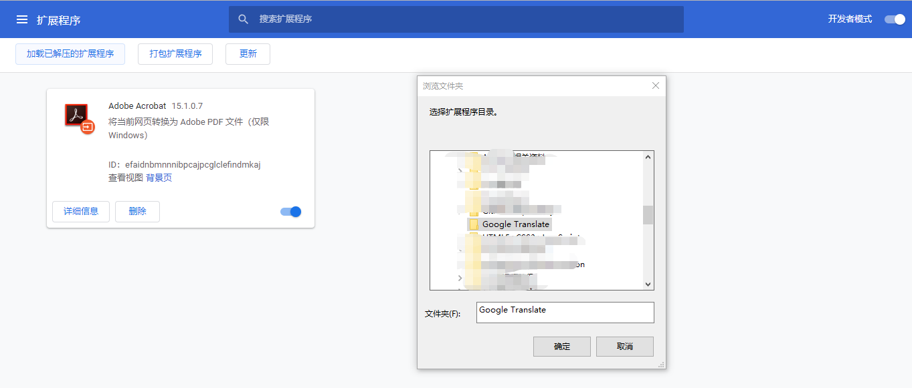

## 谷歌翻译自动换行扩展小程序的使用说明： ##

**声明：这个小小小工具主要完成谷歌翻译网页版输入框的文本自动换行的功能，主要用于在一些PDF格式的文章中，直接赋值粘贴到谷歌翻译后，导致句子断断续续，进而导致右侧的翻译输出结果不令人满意，如果每次都一行一行的缩进实在费时。此代码由网上资料整合，有问题请通过以下方式联系我：**

**Email:  wangzhonghua1993@gmail.com**
   

1.首先在Chrome的地址栏输入： **chrome://extensions**，进入到Chrome 扩展程序的页面；

2.开启右侧的**开发者模式**，然后点击**加载以解压的扩展程序**，选中**Google Translate**文件夹，如下图所示：

3.然后就会在扩展程序的页面下发现谷歌翻译的扩展小程序已经被加载进来了，如下图所示，然后关闭开发者模式即可。

4.之后打开自己谷歌翻译的网页 https://translate.google.cn 输入文本，默认情况下不会自动换行，若需要换行，需要手动按一下键盘上的**F5**刷新一下，就会看到输入框中的文本已经换行成功。

**注意：由于谷歌禁止了第三方的扩展程序插件，需要交付5美元才能把自己的扩展程序发布到Google的商店中，不过不交付就会在每次重新启动Google浏览器的时候出现下方的提示，点击取消就可以正常使用了。尝试了网上的几种解决办法，都没有成功，似乎和Chrome的版本也有关系。**

